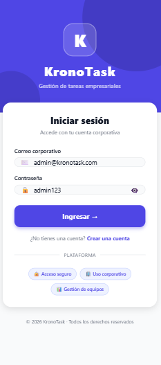
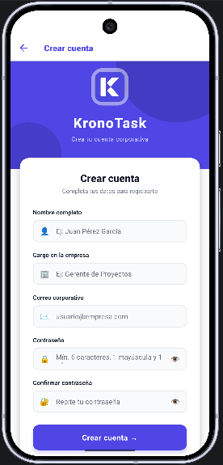
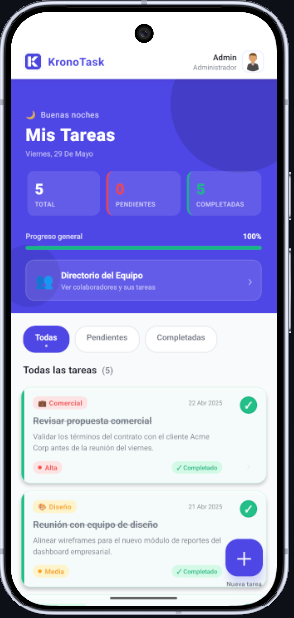
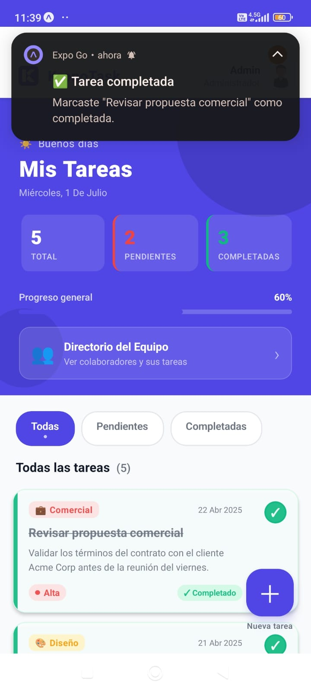
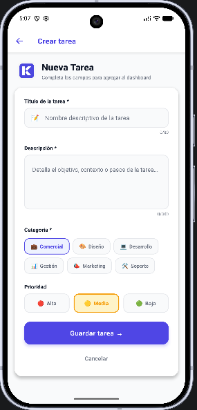
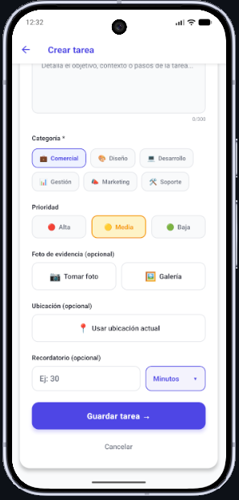
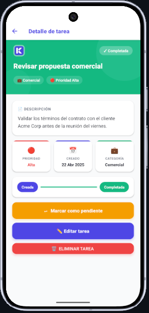
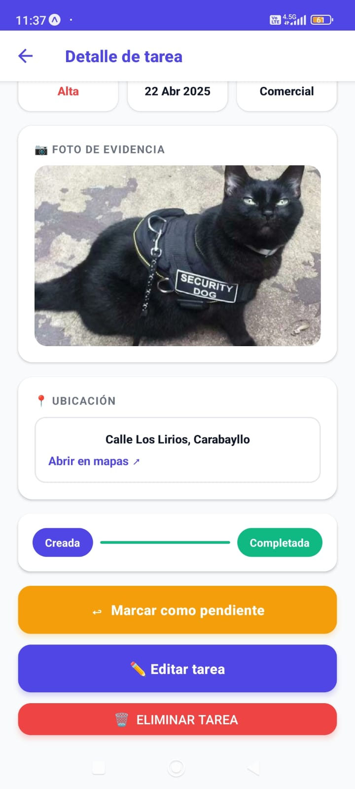
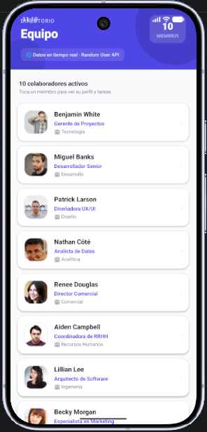

# 📋 KronoTask
### Aplicación Móvil de Gestión de Tareas Empresariales

<p align="center">
  
  
  
  
  
  
</p>

---

## 📌 Descripción del Proyecto

**KronoTask** es una aplicación móvil multiplataforma orientada a la gestión de tareas dentro de un entorno empresarial. Permite a los usuarios organizar, visualizar y dar seguimiento a sus actividades diarias de manera eficiente, facilitando la productividad y el control operativo.

Desarrollada con **React Native** y **Expo**, la aplicación implementa buenas prácticas en estructuración de código, diseño responsivo y organización de componentes, con un flujo de navegación claro e intuitivo.

---

## 👥 Equipo de Desarrollo

| # | Nombre Completo | Rol |
|---|---|---|
| 1 | Fabricio Manuel Munives Santamaría | Desarrollador Mobile / Frontend / Backend / DB |
| 2 | Elmer Diego Falla Samaniego | Desarrollador Mobile / Frontend / Backend / DB |

---

## 🎨 Paleta de Colores

La paleta fue seleccionada para transmitir profesionalismo, claridad visual y buena legibilidad en entornos empresariales.

| Token | Color | Hex | Uso |
|---|---|---|---|
| `primary` | 🟣 Índigo | `#4F46E5` | Botones principales, headers, badges activos |
| `primaryDark` | 🟣 Índigo oscuro | `#3730A3` | Hover y estados presionados |
| `secondary` | 🟢 Esmeralda | `#10B981` | Tareas completadas, confirmaciones |
| `background` | ⚪ Gris claro | `#F9FAFB` | Fondo general de pantallas |
| `surface` | ⚪ Blanco | `#FFFFFF` | Cards, formularios, modales |
| `textPrimary` | ⚫ Gris oscuro | `#111827` | Títulos y texto principal |
| `textSecondary` | 🩶 Gris medio | `#6B7280` | Subtítulos, placeholders |
| `border` | 🩶 Gris borde | `#E5E7EB` | Bordes de inputs y separadores |
| `danger` | 🔴 Rojo | `#EF4444` | Errores, eliminar, alertas |
| `warning` | 🟡 Ámbar | `#F59E0B` | Prioridad media, advertencias |

---

## 🛠️ Tecnologías y Lenguajes

| Tecnología | Versión | Descripción |
|---|---|---|
| **React Native** | 0.81 | Framework principal para desarrollo móvil multiplataforma (New Architecture) |
| **Expo** | SDK 54 | Entorno de desarrollo y herramienta de build |
| **JavaScript (ES6+)** | — | Lenguaje principal de programación |
| **JSX** | — | Extensión de sintaxis para la definición de interfaces |
| **CSS-in-JS (StyleSheet)** | — | Estilos mediante la API nativa de React Native |
| **React Navigation** | v7 | Navegación entre pantallas (Native Stack) |
| **AsyncStorage** | 2.1+ | Persistencia de datos local por usuario |
| **expo-image-picker** | — | Acceso a cámara y galería del dispositivo |
| **expo-location** | — | Acceso al GPS y geocodificación inversa |
| **expo-notifications** | — | Notificaciones locales programadas |
| **expo-device** | — | Detección de dispositivo físico vs. emulador |
| **Random User API** | — | API pública para directorio del equipo con fotos reales |
| **JSONPlaceholder API** | — | API pública para tareas asignadas por miembro |

---

## 💻 Entorno de Desarrollo

| Herramienta | Descripción |
|---|---|
| **Visual Studio Code** | Editor de código principal |
| **Expo Go** | App para previsualización en dispositivo físico (Avances 1 y 2) |
| **Development Build** | Build nativo generado con `npx expo run:android` (Avance 3) |
| **Android Emulator** | Emulador de dispositivo Android (Android Studio) |
| **Git + GitHub** | Control de versiones y repositorio remoto |
| **Node.js** | Entorno de ejecución necesario para Expo y npm |

### Extensiones recomendadas para VS Code

| Extensión | ID | Descripción |
|---|---|---|
| ES7+ React/Redux Snippets | `dsznajder.es7-react-js-snippets` | Snippets para componentes React Native |
| Prettier | `esbenp.prettier-vscode` | Formateador de código automático |
| ESLint | `dbaeumer.vscode-eslint` | Linter para mantener buenas prácticas |
| React Native Tools | `msjsdiag.vscode-react-native` | Soporte oficial de debugging para RN |
| GitLens | `eamodio.gitlens` | Visualización avanzada del historial Git |
| Auto Rename Tag | `formulahendry.auto-rename-tag` | Renombra etiquetas JSX automáticamente |
| Material Icon Theme | `PKief.material-icon-theme` | Íconos visuales para archivos y carpetas |

---

## 📁 Estructura del Proyecto (Proyecto Final)

```
KronoTask/
│
├── android/                       # Código nativo generado (development build)
├── assets/                        # Recursos estáticos (imágenes, íconos, splash)
│   └── images/
│
├── src/
│   ├── components/                   # Componentes reutilizables
│   │   ├── ErrorBoundary.jsx         # ★ NUEVO — Captura errores de render globales
│   │   ├── TaskCard.jsx              # Tarjeta de tarea (optimizada con React.memo)
│   │   └── UserMenuButton.jsx        # Avatar con menú desplegable de sesión
│   │
│   ├── context/                      # Estado global de la aplicación
│   │   ├── AuthContext.jsx           # Autenticación con logging integrado
│   │   └── TaskContext.jsx           # Tareas con notificaciones y logging
│   │
│   ├── hooks/                        # Hooks personalizados
│   │   └── useApi.js                 # Hook para consumo de APIs con loading/error/data
│   │
│   ├── navigation/                   # Configuración de navegación
│   │   └── AppNavigator.jsx          # Stack Navigator principal
│   │
│   ├── screens/                      # Pantallas de la aplicación
│   │   ├── LoginScreen.jsx           # Pantalla de inicio de sesión
│   │   ├── CreateAccountScreen.jsx   # Pantalla de registro de usuario
│   │   ├── HomeScreen.jsx            # Dashboard principal (FlatList optimizada)
│   │   ├── CreateTaskScreen.jsx      # ★ ACTUALIZADO — Cámara, GPS y recordatorio
│   │   ├── TaskDetailScreen.jsx      # ★ ACTUALIZADO — Muestra foto, ubicación y recordatorio
│   │   └── TeamScreen.jsx            # Directorio del equipo (Random User API)
│   │
│   ├── services/                     # Capa de servicios externos
│   │   └── api.js                    # Random User API + JSONPlaceholder con logging
│   │
│   ├── theme/                        # Estilos y tokens globales
│   │   └── colors.js                 # Paleta de colores centralizada
│   │
│   └── utils/                        # Utilidades y lógica transversal
│       ├── device.js                 # ★ NUEVO — Helpers de cámara, galería y GPS
│       ├── error.js                  # Lógica de manejo de errores
│       ├── logger.js                 # ★ NUEVO — Sistema de logging centralizado
│       ├── normalize.js              # Normalización de datos (extendido con campos nativos)
│       ├── notifications.js          # ★ NUEVO — Notificaciones locales programadas
│       └── permissions.js            # ★ NUEVO — Gestión centralizada de permisos
│
├── App.jsx                           # Punto de entrada con ErrorBoundary + Providers
├── app.json                          # Configuración de Expo (plugins nativos incluidos)
├── package.json                      # Dependencias del proyecto
├── compilar-android.cmd             # ★ NUEVO — Script de build automatizado (Windows)
├── DOCUMENTACION-SESION.md          # ★ NUEVO — Bitácora técnica del build nativo
└── README.md                         # Documentación del proyecto
```

---

## ⚙️ Instalación y Configuración

### Prerrequisitos

Asegúrate de tener instalados los siguientes programas antes de continuar:

- [Node.js](https://nodejs.org/) (versión LTS recomendada, 18+)
- [Visual Studio Code](https://code.visualstudio.com/)
- [Git](https://git-scm.com/)
- [Android Studio](https://developer.android.com/studio) con SDK de Android 12+ instalado
- Cuenta en [Expo](https://expo.dev/) (gratuita)
- App **Expo Go** instalada en tu dispositivo móvil

---

### Paso 1 — Verificar instalación de Node.js y npm

```bash
node --version
npm --version
```

---

### Paso 2 — Instalar Expo CLI de forma global

```bash
npm install -g expo-cli
```

Verificar instalación:

```bash
expo --version
```

---

### Paso 3 — Clonar el proyecto (o crearlo desde cero con Expo)

```bash
# Clonar el repositorio existente
git clone <url-del-repositorio> kronotask
cd kronotask
npm install
```

> Si se desea recrear la base desde cero: `npx create-expo-app@latest kronotask`
>
> **Importante:** en Windows, mantén la carpeta en una ruta corta (ej. `C:\Users\usuario\GitHub\kronotask`). Las rutas largas superan el límite de 260 caracteres y hacen fallar la compilación nativa.

---

### Paso 4 — Instalar dependencias de navegación

```bash
npx expo install @react-navigation/native @react-navigation/native-stack
npx expo install react-native-screens react-native-safe-area-context
```

---

### Paso 5 — Instalar dependencias complementarias del Avance 2

```bash
# Íconos vectoriales
npx expo install @expo/vector-icons

# Manejo de fuentes personalizadas (opcional pero recomendado)
npx expo install expo-font

# Persistencia local — requerido para autenticación y almacenamiento de tareas
npx expo install @react-native-async-storage/async-storage
```

---

### Paso 6 — Instalar dependencias del Avance 3 (funcionalidades nativas)

```bash
# Cámara y galería
npx expo install expo-image-picker

# GPS y geocodificación inversa
npx expo install expo-location

# Notificaciones locales
npx expo install expo-notifications

# Detección de dispositivo físico
npx expo install expo-device
```

---

### Paso 7 — Ejecutar la aplicación

```bash
npx expo start
```

Luego elige una de las siguientes opciones en la terminal:

| Tecla | Acción |
|---|---|
| `a` | Abrir en emulador Android |
| `i` | Abrir en simulador iOS (solo Mac) |
| `w` | Abrir en navegador web |
| Escanear QR | Visualizar en dispositivo físico con Expo Go |

---

### Paso 8 — Generar el build nativo (requerido para el Avance 3 y el Proyecto Final)

A partir del Avance 3, la app utiliza funcionalidades nativas del dispositivo (cámara, GPS, notificaciones) que requieren un **development build** en lugar de Expo Go.

```bash
# Generar la carpeta android/ con código nativo
npx expo prebuild --platform android

# Compilar e instalar en el dispositivo o emulador
npx expo run:android
```

> **Nota:** La primera compilación puede tardar entre 5 y 15 minutos porque Gradle descarga todas las dependencias nativas. Las compilaciones posteriores tardan 1–2 minutos.

#### 🚀 Opción rápida en Windows: `compilar-android.cmd`

El repositorio incluye el script **`compilar-android.cmd`** en la raíz, que automatiza todo el flujo de compilación con un doble clic. El script:

1. Configura `ANDROID_HOME`, `JAVA_HOME` y el `PATH` solo para esa ventana (usa el JDK integrado de Android Studio).
2. Verifica que `adb` y `java` existan antes de empezar.
3. Detiene daemons de Gradle antiguos y limpia cachés de compilaciones previas.
4. Verifica el dispositivo conectado (`adb devices`).
5. Compila e instala con `npx expo run:android`, guardando el log completo en `build-log-k.txt`.

#### ✅ Requisitos del entorno de build

| Requisito | Detalle |
|---|---|
| **Android Studio** | Con SDK Platform 34+ y Android SDK Platform-Tools instalados |
| **Ruta corta** | La carpeta del proyecto debe estar en una ruta corta (ej. `C:\Users\usuario\GitHub\kronotask`). Rutas largas superan el límite de 260 caracteres de Windows y provocan un error de `ninja` |
| **Teléfono Android** | Con **Depuración USB** e **Instalar vía USB** activados en Opciones de desarrollador |
| **Variables** | `ANDROID_HOME` apuntando al SDK y `platform-tools` en el `PATH` |

---

### Paso 9 (opcional) — Ejecutar en modo desarrollo (tras el primer build)

Una vez instalada la APK, para continuar el desarrollo con hot reload:

```bash
npx expo start --dev-client
```

Abre la app **KronoTask** en tu dispositivo (no Expo Go) y se conectará automáticamente al servidor de desarrollo.

---

### Credenciales de acceso de prueba

| Campo | Valor |
|---|---|
| Correo | `admin@kronotask.com` |
| Contraseña | `Admin123` |

---

## 📱 Vistas — Avance 2 (Semana 10)

Este segundo avance cuenta con **6 pantallas** funcionales, autenticación local completa, persistencia de datos por usuario y consumo de dos APIs externas en tiempo real.

---

### 1. 🔐 Pantalla de login
**Archivo:** `src/screens/LoginScreen.jsx`

Pantalla de inicio de sesión con validación de credenciales contra AsyncStorage.

| Elemento | Detalle |
|---|---|
| Campos | Correo corporativo y contraseña |
| Validaciones | Campo vacío, formato de email, mínimo 6 caracteres |
| Autenticación | Verifica credenciales contra usuarios guardados en AsyncStorage |
| Retroalimentación | Banner de error al ingresar credenciales incorrectas, animación de shake |
| Show/hide | Botón para mostrar u ocultar contraseña |
| Navegación | Guard automático redirige al Home si hay sesión activa |
| Componentes | `TextInput`, `TouchableOpacity`, `KeyboardAvoidingView`, `ScrollView`, `Image`, `Animated` |

---

### 2. 👤 Pantalla de crear cuenta
**Archivo:** `src/screens/CreateAccountScreen.jsx`

Formulario de registro empresarial que guarda el usuario en AsyncStorage.

| Elemento | Detalle |
|---|---|
| Campos | Nombre completo, cargo en la empresa, correo corporativo, contraseña y confirmar contraseña |
| Validaciones | Campos obligatorios, solo letras en nombre, formato de email, mínimo 6 caracteres, al menos 1 mayúscula y 1 número, coincidencia de contraseñas |
| Persistencia | Usuario guardado en AsyncStorage con clave `@kronotask_registered_users` |
| Retroalimentación | Indicador de requisitos en tiempo real, confirmación verde al coincidir contraseñas, banner de error si el correo ya existe |
| Animaciones | Shake al error, pantalla de éxito animada al crear cuenta |
| Show/hide | Botón para mostrar u ocultar contraseña en ambos campos |
| Navegación | Guard automático redirige al Home tras el registro |
| Componentes | `TextInput`, `TouchableOpacity`, `KeyboardAvoidingView`, `ScrollView`, `Image`, `Animated` |

---

### 3. 🏠 Pantalla principal (Dashboard)
**Archivo:** `src/screens/HomeScreen.jsx`

Panel principal con tareas persistidas por usuario y acceso al directorio del equipo.

| Elemento | Detalle |
|---|---|
| Barra superior | Logo y nombre de la app a la izquierda, avatar con menú desplegable a la derecha |
| Menú de usuario | Al tocar el avatar aparece dropdown con info del usuario y opción de cerrar sesión |
| Lista dinámica | Renderizada con `FlatList` optimizada (`removeClippedSubviews`, `maxToRenderPerBatch`, `windowSize`) |
| Filtros | Todas / Pendientes / Completadas |
| Estadísticas | Cards con total, pendientes y completadas por usuario |
| Progreso | Barra animada con porcentaje de tareas completadas |
| Directorio | Banner de acceso rápido a la pantalla del equipo |
| Almacenamiento | Tareas únicas por cuenta — clave `@kronotask_tasks_<userId>` |
| Componentes | `FlatList`, `TouchableOpacity`, `Image`, `Animated`, `ActivityIndicator`, `TaskCard` |

---

### 4. ✏️ Pantalla de crear / editar tarea (Actualizada en Avance 3)
**Archivo:** `src/screens/CreateTaskScreen.jsx`

Formulario interactivo para registrar nuevas tareas. En el Avance 3 se incorporaron tres secciones de funcionalidades nativas del dispositivo.

| Elemento | Detalle |
|---|---|
| Campos base | Título (máx. 80 caracteres) y descripción (máx. 300 caracteres) |
| Validaciones | Campos obligatorios, mínimo 5 caracteres en título y 10 en descripción |
| Categoría | Selector visual: 💼 Comercial / 🎨 Diseño / 💻 Desarrollo / 📊 Gestión / 📣 Marketing / 🛠️ Soporte |
| Prioridad | Selector visual: 🔴 Alta / 🟡 Media / 🟢 Baja |
| 📷 Foto de evidencia | Botones "Tomar foto" (cámara) y "Galería" con preview de imagen y opción de quitar |
| 📍 Ubicación GPS | Registra la posición actual con geocodificación inversa (dirección legible) |
| 🔔 Recordatorio | Campo numérico + desplegable de unidad (segundos / minutos / horas / días); valida en tiempo real |
| Vista previa | Previsualización en tiempo real de la tarea mientras se escribe |
| Animaciones | Shake al error, animación de entrada del formulario, botón animado |
| Persistencia | Foto, ubicación, recordatorio, `reminderValue` y `reminderUnit` guardados junto con la tarea |
| Componentes | `TextInput`, `TouchableOpacity`, `ScrollView`, `KeyboardAvoidingView`, `Image`, `Animated`, `ActivityIndicator` |


---

### 5. 🔍 Pantalla de detalle de tarea (Actualizada en Avance 3)
**Archivo:** `src/screens/TaskDetailScreen.jsx`

Vista detallada de una tarea. En el Avance 3 se agregaron secciones para mostrar la evidencia fotográfica, la ubicación y el recordatorio programado.

| Elemento | Detalle |
|---|---|
| Información | Título, descripción, estado, prioridad, categoría y fecha de creación |
| Header dinámico | Cambia de color índigo a verde según el estado de la tarea |
| Metadatos | Cards con prioridad, fecha de creación y categoría |
| 📷 Foto de evidencia | Muestra la imagen adjunta a tamaño completo si existe |
| 📍 Ubicación | Muestra la dirección registrada con botón para abrir en Google/Apple Maps |
| 🔔 Recordatorio | Muestra la fecha y hora programada; indica si está pendiente de disparar |
| Barra de estado | Indicador visual del flujo: Creada → En curso / Completada |
| Acciones | Marcar como completada / pendiente (cancela el recordatorio automáticamente) y eliminar |
| Persistencia | Cambios de estado y eliminación sincronizados con AsyncStorage |
| Animaciones | Fade + slide de entrada, animación del botón de acción, header animado según estado |
| Componentes | `ScrollView`, `TouchableOpacity`, `Button`, `Image`, `Animated`, `Alert`, `Linking` |

---

### 6. 👥 Pantalla de directorio del equipo
**Archivo:** `src/screens/TeamScreen.jsx`

Directorio corporativo con perfiles reales obtenidos de dos APIs externas en tiempo real.

| Elemento | Detalle |
|---|---|
| API principal | Random User API — fotos reales de perfil, nombre, cargo, ciudad, país y edad |
| API secundaria | JSONPlaceholder — tareas asignadas por miembro del equipo |
| Equipo personalizado | Cada cuenta ve un equipo distinto (seed basado en el userId) |
| Fotos de perfil | `Image` con URI de red en tres tamaños: thumbnail, medium y large |
| Estado loading | Skeleton animado mientras se cargan los datos |
| Estado error | Pantalla de error con botón "Reintentar" que relanza la petición |
| Estado vacío | Pantalla con mensaje si no hay miembros disponibles |
| Pull-to-refresh | Desliza hacia abajo para recargar el directorio en tiempo real |
| Modal de detalle | Al tocar un miembro se abre modal con perfil completo y sus tareas |
| Hook personalizado | `useApi` gestiona los estados loading, error y data de cada petición |
| Componentes | `FlatList`, `Image`, `ActivityIndicator`, `RefreshControl`, `Animated`, `Modal` |

### Flujo de navegación

```
App inicia
  ├── Sin sesión  ──▶ LoginScreen
  │                       ├──▶ CreateAccountScreen ──▶ (guard redirige a Home)
  │                       └──▶ (guard redirige a Home al loguearse)
  │
  └── Con sesión ──▶ HomeScreen
                        ├──▶ TeamScreen ──▶ (regresa al Home)
                        ├──▶ CreateTaskScreen ──▶ (regresa al Home)
                        └──▶ TaskDetailScreen ──▶ (regresa al Home)

HomeScreen (avatar) ──▶ Menú desplegable ──▶ Cerrar sesión ──▶ LoginScreen
```

---
## 📱 Funcionalidades Nativas — Avance 3 (Semana 15)

El Avance 3 incorpora integración directa con el hardware del dispositivo a través de tres funcionalidades nativas conectadas al flujo de gestión de tareas.

---

### 1. 📷 Cámara y Galería (`expo-image-picker`)

Permite adjuntar una **foto de evidencia** a cualquier tarea, siguiendo el flujo habitual de un entorno empresarial donde los colaboradores documentan el resultado de su trabajo con imágenes.

| Aspecto | Detalle |
|---|---|
| Fuente | Cámara del dispositivo o galería de fotos |
| Calidad | Comprimida al 60% para no saturar el almacenamiento local |
| Relación de aspecto | 4:3, con recorte asistido habilitado |
| Preview | Imagen visible en el formulario antes de guardar |
| Persistencia | URI guardado en el campo `photoUri` de la tarea |
| Visualización | Mostrada en `TaskDetailScreen` al consultar el detalle |

---

### 2. 📍 GPS y Geocodificación Inversa (`expo-location`)

Registra la **ubicación geográfica** desde donde se crea la tarea. Útil para equipos de campo (técnicos, vendedores, inspectores) que trabajan en distintas sedes o ubicaciones.

| Aspecto | Detalle |
|---|---|
| Precisión | `Accuracy.Balanced` — equilibrio entre exactitud y consumo de batería |
| Geocodificación | Convierte las coordenadas en una dirección legible (calle, distrito, ciudad) |
| Fallback | Si no hay conexión para el geocoder, muestra las coordenadas directamente |
| Persistencia | Objeto `{ latitude, longitude, address }` guardado en la tarea |
| Visualización | Dirección mostrada en `TaskDetailScreen` con botón que abre Google/Apple Maps |

---

### 3. 🔔 Notificaciones Locales (`expo-notifications`)

Implementa un sistema de **recordatorios programados** vinculados al ciclo de vida de cada tarea.

| Evento | Comportamiento |
|---|---|
| Crear tarea con recordatorio | Se programa una notificación local en la fecha calculada |
| Completar tarea | El recordatorio se cancela automáticamente y se dispara una notificación de confirmación inmediata |
| Eliminar tarea | El recordatorio pendiente se cancela para no dejar notificaciones huérfanas |
| Editar tarea | El recordatorio anterior se cancela y se reprograma con los nuevos valores |

**Selección del recordatorio:** campo numérico libre (1–9999) con desplegable de unidad (Segundos / Minutos / Horas / Días). Validación en tiempo real con bloqueo del botón guardar ante valores inválidos.

> **Nota técnica:** KronoTask utiliza exclusivamente **notificaciones locales** (programadas en el propio dispositivo), no notificaciones remotas push. Esto es intencional: no se requiere servidor externo ni API key, y funciona sin conexión a internet.

#### 🔧 Compatibilidad con Expo SDK 52+ (`src/utils/notifications.js`)

El sistema de recordatorios se ajustó a los cambios de la API de `expo-notifications` en las versiones recientes del SDK:

- **Trigger tipado:** desde SDK 52 el disparador debe ser un objeto tipado. Se usa `SchedulableTriggerInputTypes.DATE` con la fecha y el `channelId`, en lugar de pasar un objeto `Date` directo (que dejaba de programar la notificación de forma silenciosa).
- **Handler actualizado:** desde SDK 53 se emplean `shouldShowBanner` y `shouldShowList` (además de `shouldShowAlert` por compatibilidad) para que la notificación se muestre como banner con la app en primer plano.

```js
// Programación del recordatorio (forma correcta en SDK 52+)
trigger: {
  type: Notifications.SchedulableTriggerInputTypes.DATE,
  date: fireDate,
  channelId: "default",
}
```

---

## 🔐 Gestión de Permisos — Avance 3 (Semana 15)

Todos los permisos se gestionan de forma centralizada a través de `src/utils/permissions.js`, que distingue tres estados posibles:

| Estado | Descripción | Comportamiento en la app |
|---|---|---|
| `granted` | El usuario concedió el permiso | La funcionalidad se ejecuta normalmente |
| `denied` | El usuario rechazó pero puede volver a pedir | Alert informativo invitando a intentar de nuevo |
| `blocked` | El usuario rechazó de forma permanente | Alert con botón **"Abrir Ajustes"** que lleva directamente a la configuración del sistema |

### Permisos requeridos

| Permiso | Cuándo se solicita | Plataforma |
|---|---|---|
| `CAMERA` | Al tocar "Tomar foto" por primera vez | Android / iOS |
| `MEDIA_LIBRARY` | Al tocar "Galería" por primera vez | Android / iOS |
| `ACCESS_FINE_LOCATION` | Al tocar "Usar ubicación actual" | Android |
| `ACCESS_COARSE_LOCATION` | Al tocar "Usar ubicación actual" | Android |
| `POST_NOTIFICATIONS` | Al programar el primer recordatorio | Android 13+ |
| `NSCameraUsageDescription` | Al tocar "Tomar foto" por primera vez | iOS |
| `NSPhotoLibraryUsageDescription` | Al tocar "Galería" por primera vez | iOS |
| `NSLocationWhenInUseUsageDescription` | Al tocar "Usar ubicación actual" | iOS |

---

## ⚡ Rendimiento y Calidad de Código — Avance 3 (Semana 15)

### Sistema de Logging (`src/utils/logger.js`)

Logger centralizado con cuatro niveles de severidad. En desarrollo imprime en consola con el contexto del módulo de origen. Mantiene un buffer de los últimos 100 eventos en memoria que se limpia automáticamente al cerrar sesión.

| Nivel | Uso |
|---|---|
| `INFO` | Eventos normales: login exitoso, tarea creada, carga desde storage |
| `WARN` | Situaciones esperadas pero anómalas: credenciales incorrectas, permiso denegado |
| `ERROR` | Fallos reales: error de red, fallo en AsyncStorage, crash de notificación |
| `DEBUG` | Trazas de desarrollo: inicio/fin de peticiones API, guardado de tareas |

**Puntos de logging implementados:**

- `AuthContext` — login, registro, restauración de sesión y logout
- `TaskContext` — carga/guardado de storage y cada operación CRUD
- `api.js` — inicio, éxito y fallo de cada petición a las APIs externas
- `ErrorBoundary` — captura y registra cualquier crash de render

### Error Boundary (`src/components/ErrorBoundary.jsx`)

Capa de seguridad que envuelve toda la app en `App.jsx`. Si un componente lanza un error durante el render, intercepta el crash, lo registra en el Logger y muestra una pantalla de recuperación con botón "Reintentar" en lugar de una pantalla en blanco.

### Optimizaciones de Rendimiento

| Técnica | Dónde se aplica | Beneficio |
|---|---|---|
| `React.memo` | `TaskCard.jsx` | Evita re-renders cuando el padre actualiza estado no relacionado con la tarjeta |
| `useCallback` | `HomeScreen.jsx` (`keyExtractor`, `renderItem`) | Estabiliza las referencias de función entre renders |
| `useMemo` | `HomeScreen.jsx` (filtros, contadores) | Recalcula derivados de la lista solo cuando cambia `tasks` |
| `removeClippedSubviews` | `FlatList` en `HomeScreen` | Libera memoria de items fuera del viewport |
| `maxToRenderPerBatch={10}` | `FlatList` en `HomeScreen` | Limita los items renderizados por frame |
| `windowSize={5}` | `FlatList` en `HomeScreen` | Reduce el área de pre-renderizado |
| `isMounted` ref | `useApi.js` | Evita actualizar el estado de un componente ya desmontado |
| `cancelToken` pattern | `TaskContext.jsx` | Cancela la carga de storage si el usuario cambia de cuenta antes de que termine |

---

## 🔌 APIs Externas Consumidas

| API | Endpoint | Uso | Autenticación |
|---|---|---|---|
| **Random User API** | `randomuser.me/api/?results=10&seed=<userId>` | Directorio del equipo con fotos reales | Sin API key |
| **JSONPlaceholder** | `jsonplaceholder.typicode.com/todos?userId=<id>` | Tareas asignadas por miembro | Sin API key |

---

## 💾 Almacenamiento Local (AsyncStorage)

| Clave | Contenido | Descripción |
|---|---|---|
| `@kronotask_registered_users` | Array de usuarios registrados | Cuentas creadas en la app |
| `@kronotask_current_session` | Objeto del usuario activo | Sesión activa (sin contraseña) |
| `@kronotask_tasks_<userId>` | Array de tareas del usuario | Tareas únicas por cuenta, incluye `photoUri`, `location`, `reminderAt`, `notificationId`, `reminderValue` y `reminderUnit` |

---

## ⚠️ Limitaciones Conocidas

| Limitación | Descripción |
|---|---|
| Notificaciones en Expo Go | A partir del SDK 53, Expo Go eliminó soporte para notificaciones remotas (push). KronoTask usa solo notificaciones **locales**, que sí funcionan. El aviso en consola es informativo y no afecta el funcionamiento. Se recomienda usar un development build (`npx expo run:android`) para evitar el mensaje. |
| Almacenamiento de fotos | Las fotos se guardan como URI local del dispositivo. Si el usuario desinstala la app o borra la caché, las URIs quedan inválidas. En producción se debería subir las imágenes a un servidor. |
| GPS en interiores | La precisión del GPS puede reducirse en espacios cerrados. La geocodificación inversa requiere conexión a internet. |
| Contraseñas en texto plano | Las contraseñas se guardan sin cifrado en AsyncStorage. Es una limitación aceptable para un proyecto académico; en producción se usaría hashing (bcrypt). |
| Rutas largas en Windows | La compilación nativa (`ninja`) falla si la ruta del proyecto supera el límite de 260 caracteres de Windows. Solución: mantener la carpeta en una ruta corta como `C:\...\GitHub\kronotask`. |
| Instalación por USB | Algunos fabricantes (Xiaomi, etc.) bloquean la instalación por USB (`INSTALL_FAILED_USER_RESTRICTED`). Debe activarse **"Instalar vía USB"** en Opciones de desarrollador. |


---

## 🗺️ Roadmap del Proyecto

| Avance | Contenido | Estado |
|---|---|---|
| **Avance 1** | Estructura, interfaz, navegación, formularios con validaciones | ✅ Completado |
| **Avance 2** | Hooks, consumo de APIs, persistencia con AsyncStorage, autenticación local | ✅ Completado |
| **Avance 3** | Funcionalidades nativas (cámara, GPS, notificaciones), gestión de permisos, rendimiento y logging | ✅ Completado |
| **Proyecto Final** | Build nativo Android funcionando en dispositivo físico, corrección de notificaciones, limpieza de configuración y dependencias, script de compilación automatizado | ✅ Completado |

---

## 🏗️ Arquitectura General

KronoTask sigue una arquitectura por capas con separación de responsabilidades, pensada para ser mantenible y escalable dentro de un proyecto React Native.

```
┌──────────────────────────────────────────────────────────┐
│  Capa de Presentación (screens/ + components/)            │
│  Pantallas y componentes reutilizables (UI + interacción) │
├──────────────────────────────────────────────────────────┤
│  Capa de Estado Global (context/)                         │
│  AuthContext · TaskContext (estado + lógica de negocio)   │
├──────────────────────────────────────────────────────────┤
│  Capa de Lógica y Servicios (hooks/ · services/ · utils/) │
│  useApi · api.js · notifications · permissions · logger   │
├──────────────────────────────────────────────────────────┤
│  Capa de Datos y Sistema                                  │
│  AsyncStorage (persistencia) · APIs externas · Hardware   │
│  del dispositivo (cámara, GPS, notificaciones locales)    │
└──────────────────────────────────────────────────────────┘
```

**Flujo de datos:** las pantallas consumen el estado global de los *Contexts*, que a su vez orquestan la lógica de negocio apoyándose en la capa de servicios y utilidades. La persistencia (AsyncStorage), el consumo de APIs y el acceso al hardware quedan aislados en la capa inferior, de modo que la UI nunca interactúa directamente con ellos. Un `ErrorBoundary` global envuelve toda la aplicación y un `logger` centralizado registra los eventos relevantes de cada capa.

**Principios aplicados:** separación de responsabilidades, componentes reutilizables (`React.memo`), hooks personalizados para lógica compartida (`useApi`), tokens de diseño centralizados (`theme/colors.js`) y utilidades transversales desacopladas (permisos, notificaciones, normalización de datos).

---

## 📸 Capturas de Pantalla

A continuación se muestran las principales vistas de la aplicación **KronoTask**.

---

### 🔐 Pantalla de inicio de sesión

<p align="center">
  
</p>

---

### 👤 Pantalla de crear cuenta

<p align="center">
  
</p>

---

### 🏠 Pantalla principal (Dashboard)

<p align="center">
  
</p>

<p align="center">
  
</p>

---

### ✏️ Pantalla de creación de tarea

<p align="center">
  
</p>

<p align="center">
  
</p>

---

### 🔍 Pantalla de detalle de tarea

<p align="center">
  
</p>

<p align="center">
  
</p>

---

### 👥 Pantalla de directorio del equipo

<p align="center">
  
</p>

---

## 📄 Licencia

Este proyecto fue desarrollado con fines académicos para el curso de Desarrollo de Aplicaciones Móviles.
 